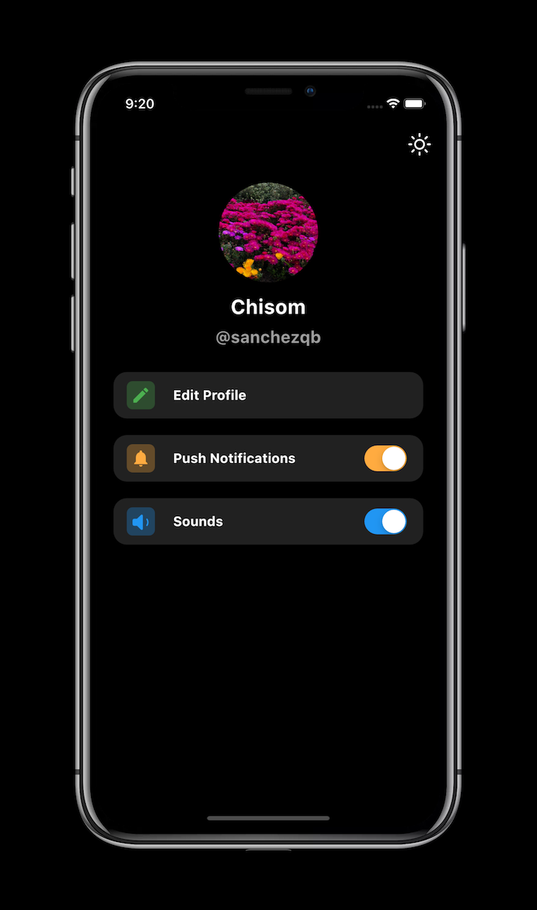

# Flutter Light Dark Theme

A simple app for switching between light and dark themes.
 

## 📸 ScreenShots

| Light| Dark|
|------|-------|
|||

## 🔌 Plugins
| Name | Usage |
|------|-------|
|[**Provider**](https://pub.dev/packages/provider)| State Management|

## 🤓 Author(s)
**Chisom Ekwuribe** 

<!-- 
## 🔖 LICENCE
[Apache-2.0](https://github.com/JideGuru/FlutterEbookApp/blob/master/LICENSE) -->